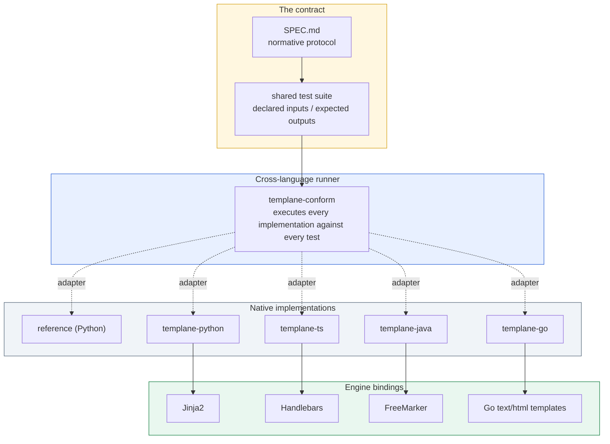

<p align="center">
  <picture>
    <source media="(prefers-color-scheme: dark)" srcset="brand/svg/mark-reverse.svg">
    
  </picture>
</p>

<h1 align="center">templane</h1>

<p align="center"><em>Schema-validated templates. Same behavior in Java, Python, TypeScript, and Go.</em></p>

<p align="center">
  <a href="https://central.sonatype.com/namespace/io.github.ereshzealous"></a>
  <a href="LICENSE"></a>
</p>

---

## The problem

Templates are one of the most widely deployed layers in software, and one of the least typed. Jinja2, Handlebars, FreeMarker, Go templates, ERB, Liquid, Mustache — every popular engine accepts a string-keyed dictionary, looks fields up by name at render time, and fails silently when the data does not match. The result is not a compile-time error. It is blank output, a broken email, or a customer-facing bug that surfaces days after deploy.

Templane closes that gap.

---

## What you get

Drop a small `.schema.yaml` file beside your existing template, and Templane:

- **Validates the data before the engine renders.** Missing fields, wrong types, unknown keys, invalid enum values, and likely typos are reported in a single pass — never one error at a time.
- **Leaves your templates alone.** Your `.ftl`, `.jinja`, `.hbs`, and `.tmpl` files stay in their native syntax. Templane sits beside them, not inside them.
- **Behaves identically in every language.** The same schema, the same data, and the same error set produce the same outcome whether you call it from Java, Python, TypeScript, or Go.
- **Detects breaking changes between schema versions.** Removed fields, tightened requirements, type changes, and removed enum values are flagged automatically — additive changes are not.

---

## Example

A sidecar schema beside an existing FreeMarker template:

```yaml
# greeting.schema.yaml
body: ./greeting.ftl
engine: freemarker

user:
  type: object
  required: true
  fields:
    name: { type: string, required: true }
    status:
      type: enum
      values: [active, inactive, pending]
      required: true
account:
  type: object
  required: true
  fields:
    balance: { type: number, required: true }
```

Rendered from Java:

```java
import dev.templane.freemarker.TemplaneConfiguration;

var cfg  = new TemplaneConfiguration(Path.of("templates"));
var tmpl = cfg.getTemplate("greeting.schema.yaml");

tmpl.render(Map.of(
    "user",    Map.of("name", "Alice", "status", "actve"),
    "account", Map.of("blance", 100)
));
```

Templane refuses to render and reports every problem at once:

```text
[invalid_enum_value]     user.status: 'actve' not in [active, inactive, pending]
[did_you_mean]           account.blance: unknown field — did you mean 'balance'?
[missing_required_field] account.balance: required field is missing
```

The same schema and the same input produce the same errors in Python, TypeScript, and Go.

---

## How it works

Inside every implementation, data flows through four stages before it reaches the underlying template engine:


The engine binding — FreeMarker, Jinja2, Handlebars, or Go templates — attaches at the `render` stage. Everything before that is engine-agnostic, so the validation behaviour is identical regardless of which template language you use.

---

## Cross-language consistency

Templane is a protocol with five native implementations — no shared runtime, no cross-language bridges. The diagram below shows how the protocol stays in sync across languages: a single specification declares the intended behaviour, a shared suite of acceptance tests pins down inputs and expected outputs, and a cross-language runner exercises every implementation against every test on every change.



Each implementation ships a small adapter binary that reads a test case from standard input, runs the four-stage pipeline, and writes the result to standard output. The runner spawns the adapters in parallel, feeds them every test in turn, and diffs the output against the declared expected result. Cross-language parity is therefore proven by behaviour, not by code sharing.

---

## Schema language at a glance

A schema declares the shape of the data a template expects. Field types and their options:

| Type | Purpose | Field options |
|---|---|---|
| `string` | text values | `required` |
| `number` | floating-point numbers | `required` |
| `integer` | whole numbers | `required` |
| `boolean` | `true` / `false` | `required` |
| `enum` | one of a fixed set of values | `required`, `values: [...]` |
| `list` | homogeneous array | `required`, `items: { type: ... }` |
| `object` | nested record | `required`, `fields: { ... }` |

Every option in one place:

```yaml
order_id:    { type: string,  required: true }
amount:      { type: number,  required: true }
quantity:    { type: integer, required: true }
gift:        { type: boolean }                          # optional
status:      { type: enum, values: [new, paid, shipped], required: true }
tags:        { type: list, items: { type: string } }    # optional list of strings
customer:
  type: object
  required: true
  fields:
    name:    { type: string, required: true }
    email:   { type: string, required: true }
```

Defaults defined by the protocol: a field with no `type` is `string`; a field with no `required` is optional; an `enum` with no `values` rejects every value; a `list` with no `items` is `list<string>`.

---

## Breaking-change classification

Templane includes a schema-evolution detector that classifies the diff between two schema versions into four protocol-level categories. Wire it into CI to fail builds when a schema change would break downstream consumers.

| Category | When it fires | Example diff |
|---|---|---|
| `removed_field` | A field present in the old schema is absent in the new one | Drop `customer.phone` from the schema |
| `required_change` | A field that was optional becomes required | `email: { required: true }` (was optional) |
| `type_change` | A field's declared type changes | `age: { type: integer }` (was `string`) |
| `enum_value_removed` | An enum drops a value it previously accepted | `values: [active, inactive]` (dropped `pending`) |

Additive changes — adding a new optional field, adding a new enum value, relaxing a `required` to optional — are intentionally **not** reported. Only changes that can break already-deployed callers are flagged.

---

## Implementations

| Language | Module | Engine binding | Availability |
|---|---|---|---|
| **Java** | [`templane-java`](templane-java/) | FreeMarker | [Maven Central 0.1.0](https://central.sonatype.com/namespace/io.github.ereshzealous) |
| **Python** | [`templane-python`](templane-python/) | Jinja2 | source build · PyPI publish in progress |
| **TypeScript** | [`templane-ts`](templane-ts/) | Handlebars | source build · npm publish in progress |
| **Go** | [`templane-go`](templane-go/) | `text/html` templates | source build · Go module tag in progress |

A reference implementation lives in [`templane-spec`](templane-spec/) for protocol authors. It is intentionally not published — it exists to define behaviour, not to be depended on in production code.

---

## Get started

| You write | Start here |
|---|---|
| Java + FreeMarker | [`templane-java/README.md`](templane-java/README.md) — installable from Maven Central today |
| Python + Jinja2 | [`templane-python/README.md`](templane-python/README.md) |
| TypeScript / JavaScript + Handlebars | [`templane-ts/README.md`](templane-ts/README.md) |
| Go + `text/template` | [`templane-go/README.md`](templane-go/README.md) |

Every implementation exposes the same conceptual surface — `parse`, `check`, `generate`, `render` — in a form idiomatic to its host language.

---

## Reference

- [`SPEC.md`](SPEC.md) — normative protocol and schema reference, including conformance rules, schema grammar, and the wire format for typed schemas, ASTs, and IRs

---

## Contributing

Templane is protocol-first, which sets a high bar for behavioural changes. A change to protocol semantics requires synchronized updates to [`SPEC.md`](SPEC.md), the shared test suite under [`templane-spec/fixtures/`](templane-spec/fixtures/), the reference implementation, and every conforming language implementation.

See [`CONTRIBUTING.md`](CONTRIBUTING.md) for workflow and review expectations.

---

## License

Apache License 2.0 — see [`LICENSE`](LICENSE) and [`NOTICE`](NOTICE).
