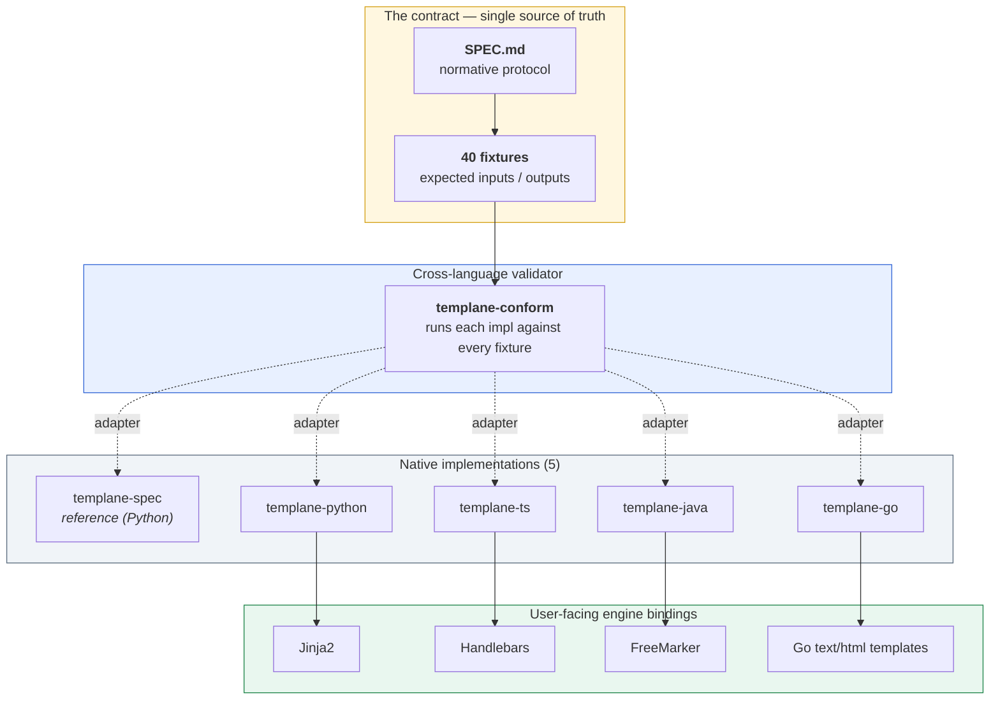

<p align="center">
  <picture>
    <source media="(prefers-color-scheme: dark)" srcset="brand/svg/mark-reverse.svg">
    
  </picture>
</p>

<h1 align="center">templane</h1>

<p align="center"><em>Typed template contracts. Cross-language. Conformance-tested.</em></p>

<p align="center">
  <a href="SPEC.md#10-conformance"></a>
  <a href="https://central.sonatype.com/namespace/io.github.ereshzealous"></a>
  <a href="LICENSE"></a>
</p>

---

## Why Templane exists

Templates are one of the most widely deployed layers in software, and one of the least typed. Jinja2, Handlebars, FreeMarker, Go templates, ERB, Liquid, Mustache — they all share the same fragile contract: pass in a bag of values, look fields up by string name, and hope the data matches.

When it doesn't, you don't get a compile-time error. You get blank output, a broken email, or a customer-visible bug four days later.

**The shape of template data is rarely declared as a real contract.** Templane adds that contract layer — once, as a protocol, with conforming implementations across five languages.

---

## What Templane is

A **protocol**, not a templating engine. It defines:

1. A YAML schema format for template input data.
2. Four shared operations: `parse`, `check`, `generate`, `render`.
3. A conformance model: 40 fixtures, identical inputs and outputs across every implementation.
4. A breaking-change classification for schema evolution.

Your existing `.jinja` / `.hbs` / `.ftl` / `.tmpl` files stay in their native syntax. Templane sits beside them as a typed contract — validating data **before** the engine ever sees it.

## What Templane is not

- Not a new templating language.
- Not a replacement for Jinja2, Handlebars, FreeMarker, or Go templates.
- Not a single shared runtime that every language wraps.
- Not just a validation library at an API boundary — it's a protocol with a fixture suite.

Each implementation is native to its host language. What's shared is the protocol, the fixtures, and the conformance bar.

---

## Architecture



**How the plumbing works.** The contract has two artifacts: `SPEC.md` (the normative rules — RFC 2119 keywords, error codes, schema grammar) and **40 fixtures** (each one is `input.json` + `schema.yaml` + `expected.html` / `expected.yaml`). Every implementation must produce byte-identical output for every fixture.

Each implementation ships a tiny **conformance adapter** — a process that reads a fixture from stdin, runs the four-op pipeline, and writes the result. The `templane-conform` runner spawns each adapter, feeds it all 40 fixtures, and diffs against the expected output. Pass = parity proven by behavior, not by sharing one runtime.

Inside an implementation, the four ops always pipe in the same order:

```
schema.yaml ──parse──► TypedSchema ──┐
                                      ├──► check ──► [valid] ──► generate ──► TIR ──► render ──► output
user data ──────────────────────────┘                  │
                                                       └─► [invalid] ──► list of every error
```

The engine binding (FreeMarker / Jinja2 / Handlebars / Go templates) plugs into the **render** step. Everything before that — schema parsing, type checking, IR generation, breaking-change detection — is engine-agnostic and shared across all 5 implementations.

---

## See it work

Sidecar schema next to a plain FreeMarker template:

```yaml
# greeting.schema.yaml
body: ./greeting.ftl
engine: freemarker

user:
  type: object
  required: true
  fields:
    name: { type: string, required: true }
    status:
      type: enum
      values: [active, inactive, pending]
      required: true
account:
  type: object
  required: true
  fields:
    balance: { type: number, required: true }
```

Render it from Java:

```java
import dev.templane.freemarker.TemplaneConfiguration;

var cfg  = new TemplaneConfiguration(Path.of("templates"));
var tmpl = cfg.getTemplate("greeting.schema.yaml");

tmpl.render(Map.of(
    "user",    Map.of("name", "Alice", "status", "actve"),  // typo
    "account", Map.of("blance", 100)                        // typo
));
```

Templane refuses, with every problem at once:

```text
[invalid_enum_value]     user.status: 'actve' not in [active, inactive, pending]
[did_you_mean]           account.blance: unknown field — did you mean 'balance'?
[missing_required_field] account.balance: required field is missing
```

The **same schema, same data, same errors** apply in Python, TypeScript, and Go. That's what conformance buys you.

---

## Implementations

| Language | Package | Engine binding | Conformance | Availability |
|---|---|---|:---:|---|
| **Java** | [`templane-java`](templane-java/) | FreeMarker | 40 / 40 | [Maven Central 0.1.0](https://central.sonatype.com/namespace/io.github.ereshzealous) |
| **Python** | [`templane-python`](templane-python/) | Jinja2 | 40 / 40 | source-build (PyPI publish pending) |
| **TypeScript** | [`templane-ts`](templane-ts/) | Handlebars | 40 / 40 | source-build (npm publish pending) |
| **Go** | [`templane-go`](templane-go/) | `text/html` templates | 40 / 40 | source-build (Go module tag pending) |
| **Reference** | [`templane-spec`](templane-spec/) | reference Python implementation | 40 / 40 | repository-only |

Total today: **5 implementations × 40 fixtures = 200 conformance passes.**

The reference implementation is intentionally not published — it exists to define behavior, not to be depended on in production.

---

## Conformance model

Templane does **not** ship one shared core that every language wraps. Each language reimplements the protocol natively. Parity is proven by the fixture suite, not by sharing a runtime. This is the central design decision of the repo — the [Architecture](#architecture) diagram above shows how it fits together.

Run the full matrix against a built repo:

```bash
node templane-spec/templane-conform/dist/cli.js \
  --adapters \
    "spec:python3 templane-spec/conform-adapter/run.py" \
    "ts:node templane-ts/dist/conform-adapter.js" \
    "py:python3 templane-python/conform-adapter/run.py" \
    "java:templane-java/conform-adapter/build/libs/conform-adapter-0.1.0.jar" \
    "go:templane-go/bin/conform-adapter"
```

Expected:

```text
Running 40 fixture(s) across 5 implementation(s)...
  ✓ spec:   40/40
  ✓ ts:     40/40
  ✓ py:     40/40
  ✓ java:   40/40
  ✓ go:     40/40
All implementations conformant.
```

---

## Pick a language

| You write | Start here |
|---|---|
| Java + FreeMarker | [`templane-java/README.md`](templane-java/README.md) — installable from Maven Central |
| Python + Jinja2 | [`templane-python/README.md`](templane-python/README.md) |
| TypeScript / JavaScript + Handlebars | [`templane-ts/README.md`](templane-ts/README.md) |
| Go + `text/template` | [`templane-go/README.md`](templane-go/README.md) |

All four implementations expose the same conceptual surface (`parse`, `check`, `generate`, `render`) idiomatic to their host language.

---

## Documentation

- [SPEC.md](SPEC.md) — normative protocol and schema reference
- [docs/ARCHITECTURE.md](docs/ARCHITECTURE.md) — internal architecture and conformance flow
- [docs/ADOPTION.md](docs/ADOPTION.md) — how to add Templane to an existing codebase
- [docs/GETTING_STARTED.md](docs/GETTING_STARTED.md) — local setup and walkthrough

---

## Contributing

Templane is protocol-first. Behavior changes carry a high bar.

A change to protocol semantics requires synchronized updates to:

1. [SPEC.md](SPEC.md)
2. fixtures under `templane-spec/fixtures/`
3. the reference implementation
4. every conforming language implementation

Start here: [CONTRIBUTING.md](CONTRIBUTING.md).

---

## License

Apache License 2.0 — see [LICENSE](LICENSE) and [NOTICE](NOTICE).
