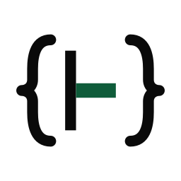
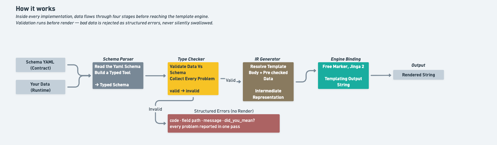
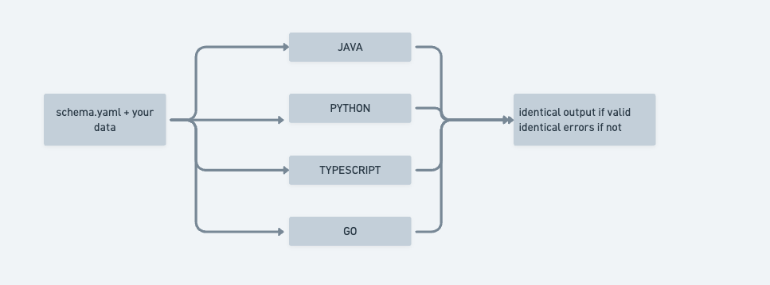
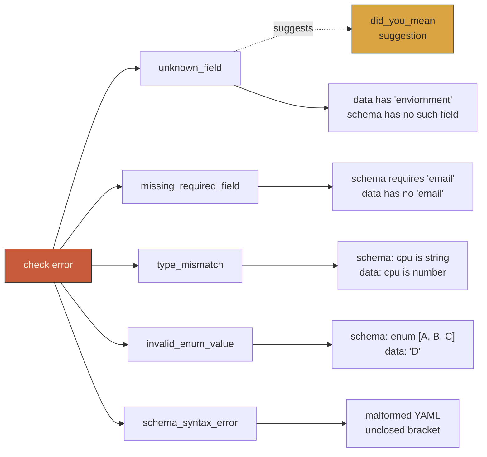

<p align="center">
  <picture>
    <source media="(prefers-color-scheme: dark)" srcset="brand/svg/mark-reverse.svg">
    
  </picture>
</p>

<h1 align="center">templane</h1>

<p align="center"><em>Schema-validated templates. Same behavior in Java, Python, TypeScript, and Go.</em></p>

<p align="center">
  <a href="https://central.sonatype.com/namespace/io.github.ereshzealous"></a>
  <a href="LICENSE"></a>
</p>

---

## The problem

Templates are one of the most widely deployed layers in software, and one of the least typed. Jinja2, Handlebars, FreeMarker, Go templates, ERB, Liquid, Mustache — every popular engine accepts a string-keyed dictionary, looks fields up by name at render time, and fails silently when the data does not match. The result is not a compile-time error. It is blank output, a broken email, or a customer-facing bug that surfaces days after deploy.

Templane closes that gap.

---

## What you get

Drop a small `.schema.yaml` file beside your existing template, and Templane:

- **Validates the data before the engine renders.** Missing fields, wrong types, unknown keys, invalid enum values, and likely typos are reported in a single pass — never one error at a time.
- **Leaves your templates alone.** Your `.ftl`, `.jinja`, `.hbs`, and `.tmpl` files stay in their native syntax. Templane sits beside them, not inside them.
- **Behaves identically in every language.** The same schema, the same data, and the same error set produce the same outcome whether you call it from Java, Python, TypeScript, or Go.
- **Detects breaking changes between schema versions.** Removed fields, tightened requirements, type changes, and removed enum values are flagged automatically — additive changes are not.

---

## Example

A sidecar schema beside an existing FreeMarker template:

```yaml
# greeting.schema.yaml
body: ./greeting.ftl
engine: freemarker

user:
  type: object
  required: true
  fields:
    name: { type: string, required: true }
    status:
      type: enum
      values: [active, inactive, pending]
      required: true
account:
  type: object
  required: true
  fields:
    balance: { type: number, required: true }
```

Rendered from Java:

```java
import dev.templane.freemarker.TemplaneConfiguration;

var cfg  = new TemplaneConfiguration(Path.of("templates"));
var tmpl = cfg.getTemplate("greeting.schema.yaml");

tmpl.render(Map.of(
    "user",    Map.of("name", "Alice", "status", "actve"),
    "account", Map.of("blance", 100)
));
```

Templane refuses to render and reports every problem at once:

```text
[invalid_enum_value]     user.status: 'actve' not in [active, inactive, pending]
[did_you_mean]           account.blance: unknown field — did you mean 'balance'?
[missing_required_field] account.balance: required field is missing
```

The same schema and the same input produce the same errors in Python, TypeScript, and Go.

---

## How it works

Inside every implementation, data flows through four stages before it reaches the underlying template engine:



The engine binding — FreeMarker, Jinja2, Handlebars, or Go templates — attaches at the `render` stage. Everything before that is engine-agnostic, so the validation behaviour is identical regardless of which template language you use.

---

## Inside each implementation

Every implementation ships the same components, in the same arrangement. Whether you read the source of `templane-java`, `templane-python`, `templane-ts`, or `templane-go`, you find the same module names, the same boundaries between them, and the same data flowing through them. That symmetry is what makes cross-language conformance meaningful — and what makes a debugging session in one language transferable to another.


Three groupings, three different concerns:

- **The render path** is what 90% of users touch. Four components, one direction, no branching except `valid` / `invalid` at the type checker.
- **Direct renderers** — `html adapter` and `yaml adapter` — take the IR and produce structured output without involving any templating engine. Useful when you want validated output but do not want to pull in FreeMarker, Jinja2, Handlebars, or Go templates.
- **Beyond rendering:** `BreakingChangeDetector` compares two parsed schemas and reports a list of breaking changes — wire it into CI for schema-evolution checks. `conform-adapter` is a small stdio bridge each implementation ships so the cross-language test runner can drive it as a subprocess.

---

## Cross-language consistency

Templane is a protocol, not a shared library. Every language ships its own native implementation — no shared runtime, no cross-language bridges. The promise is simple: **the same schema and the same data produce the same result in every language.** Identical output when validation passes; identical error set, with identical codes and field paths, when it fails.



That promise is enforced by a shared suite of input/output cases that every implementation runs on every change. Any divergence fails the build — which is how the protocol stays in lock-step across languages instead of drifting over time.

---

## Schema language at a glance

A schema declares the shape of the data a template expects. Field types and their options:

| Type | Purpose | Field options |
|---|---|---|
| `string` | text values | `required` |
| `number` | floating-point numbers | `required` |
| `integer` | whole numbers | `required` |
| `boolean` | `true` / `false` | `required` |
| `enum` | one of a fixed set of values | `required`, `values: [...]` |
| `list` | homogeneous array | `required`, `items: { type: ... }` |
| `object` | nested record | `required`, `fields: { ... }` |

Every option in one place:

```yaml
order_id:    { type: string,  required: true }
amount:      { type: number,  required: true }
quantity:    { type: integer, required: true }
gift:        { type: boolean }                          # optional
status:      { type: enum, values: [new, paid, shipped], required: true }
tags:        { type: list, items: { type: string } }    # optional list of strings
customer:
  type: object
  required: true
  fields:
    name:    { type: string, required: true }
    email:   { type: string, required: true }
```

Defaults defined by the protocol: a field with no `type` is `string`; a field with no `required` is optional; an `enum` with no `values` rejects every value; a `list` with no `items` is `list<string>`.

---

## Errors surfaced by the checker

Every type-check failure produces a structured error with a code, a field path, a human-readable message, and an optional suggestion. The checker accumulates errors — one `check` call reports every problem at once, never short-circuiting at the first.



The wire shape is identical in every implementation:

```json
{
  "code": "type_mismatch",
  "path": "resources.requests.cpu",
  "message": "Field 'resources.requests.cpu' expected string, got number",
  "did_you_mean": null
}
```

The `did_you_mean` slot only populates for `unknown_field` errors when a similarly-spelled field exists on the schema (Levenshtein distance ≤ 3) — so a typo of `enviornment` for `environment` is reported with a suggestion, while a genuinely unknown field is reported without one.

---

## Breaking-change classification

Templane includes a schema-evolution detector that classifies the diff between two schema versions into four protocol-level categories. Wire it into CI to fail builds when a schema change would break downstream consumers.

| Category | When it fires | Example diff |
|---|---|---|
| `removed_field` | A field present in the old schema is absent in the new one | Drop `customer.phone` from the schema |
| `required_change` | A field that was optional becomes required | `email: { required: true }` (was optional) |
| `type_change` | A field's declared type changes | `age: { type: integer }` (was `string`) |
| `enum_value_removed` | An enum drops a value it previously accepted | `values: [active, inactive]` (dropped `pending`) |

Additive changes — adding a new optional field, adding a new enum value, relaxing a `required` to optional — are intentionally **not** reported. Only changes that can break already-deployed callers are flagged.

---

## Implementations

| Language | Module | Engine binding | Availability |
|---|---|---|---|
| **Java** | [`templane-java`](templane-java/) | FreeMarker | [Maven Central 0.4.0](https://central.sonatype.com/namespace/io.github.ereshzealous) |
| **Python** | [`templane-python`](templane-python/) | Jinja2 | [PyPI 0.2.0](https://pypi.org/project/templane-python/) |
| **TypeScript** | [`templane-ts`](templane-ts/) | Handlebars | [npm 0.2.0](https://www.npmjs.com/package/templane-ts) |
| **Go** | [`templane-go`](templane-go/) | `text/template` | [pkg.go.dev v0.2.0](https://pkg.go.dev/github.com/ereshzealous/Templane/templane-go) |

A reference implementation lives in [`templane-spec`](templane-spec/) for protocol authors. It is intentionally not published — it exists to define behaviour, not to be depended on in production code.

---

## Get started

| You write | Start here |
|---|---|
| Java + FreeMarker | [`templane-java/README.md`](templane-java/README.md) |
| Python + Jinja2 | [`templane-python/README.md`](templane-python/README.md) |
| TypeScript / JavaScript + Handlebars | [`templane-ts/README.md`](templane-ts/README.md) |
| Go + `text/template` | [`templane-go/README.md`](templane-go/README.md) |

Every implementation exposes the same conceptual surface — `parse`, `check`, `generate`, `render` — in a form idiomatic to its host language.

---

## Reference

- [`SPEC.md`](SPEC.md) — normative protocol and schema reference, including conformance rules, schema grammar, and the wire format for typed schemas, ASTs, and IRs

---

## Contributing

Templane is protocol-first, which sets a high bar for behavioural changes. A change to protocol semantics requires synchronized updates to [`SPEC.md`](SPEC.md), the shared test suite under [`templane-spec/fixtures/`](templane-spec/fixtures/), the reference implementation, and every conforming language implementation.

See [`CONTRIBUTING.md`](CONTRIBUTING.md) for workflow and review expectations.

---

## License

Apache License 2.0 — see [`LICENSE`](LICENSE) and [`NOTICE`](NOTICE).
