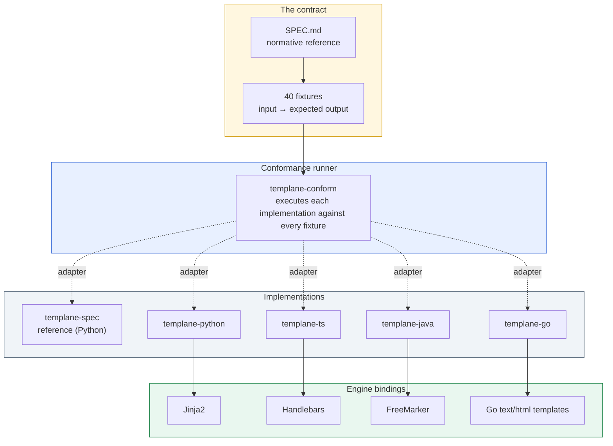

<p align="center">
  <picture>
    <source media="(prefers-color-scheme: dark)" srcset="brand/svg/mark-reverse.svg">
    
  </picture>
</p>

<h1 align="center">templane</h1>

<p align="center"><em>Typed template contracts. One protocol. Five conforming implementations.</em></p>

<p align="center">
  <a href="SPEC.md#10-conformance"></a>
  <a href="https://central.sonatype.com/namespace/io.github.ereshzealous"></a>
  <a href="LICENSE"></a>
</p>

---

## The problem

Templates are one of the most widely deployed layers in software, and one of the least typed. Jinja2, Handlebars, FreeMarker, Go templates, ERB, Liquid, Mustache — every popular engine accepts a string-keyed dictionary, looks fields up by name at render time, and fails silently when the data does not match.

The result is not a compile-time error. It is blank output, a broken email, or a customer-facing bug that surfaces days after deploy.

Templane closes this gap with a single typed contract, defined once and enforced consistently across five language implementations.

---

## The contract

Templane has three artifacts and one rule.

### 1. A specification

[`SPEC.md`](SPEC.md) is the normative reference. It defines the YAML schema grammar, the four-stage pipeline (`parse` → `check` → `generate` → `render`), the canonical error codes, and the breaking-change classification used by the schema-evolution detector.

### 2. A fixture suite

Forty concrete test cases live under [`templane-spec/fixtures/`](templane-spec/fixtures/). Each fixture is a self-contained JSON document declaring an input and an expected output:

```jsonc
{
  "fixture_id": "type-checker/missing-required",
  "input": {
    "schema": {
      "fields": {
        "name":  { "type": { "kind": "string" }, "required": true },
        "email": { "type": { "kind": "string" }, "required": true }
      }
    },
    "data": { "name": "Alice" }
  },
  "expected_output": {
    "errors": [
      { "code": "missing_required_field",
        "field": "email",
        "message": "Required field 'email' is missing" }
    ]
  }
}
```

The fixture suite is the operational definition of correctness. Coverage spans schema parsing, type checking, IR generation, sidecar resolution, and adapter rendering.

### 3. Five implementations

Each implementation is native code in its host language. There is no shared runtime, no FFI, no transpilation. Implementations are kept honest by a single rule:

> An implementation is conformant if and only if it produces the declared `expected_output` for every fixture.

Forty fixtures × five implementations = **200 conformance passes**, verified on every change.

---

## Architecture



Each implementation exposes a small adapter binary that reads a fixture from standard input and writes the produced output to standard output. The conformance runner spawns the adapters, feeds them every fixture in turn, and diffs the results against the declared `expected_output`. Cross-language parity is proven by behavioral agreement, not by code sharing.

Within an implementation, the four stages compose in a single direction:

```
schema   ──parse──►  TypedSchema ─┐
                                   ├──► check ──► [valid]   ──► generate ──► TIR ──► render ──► output
data    ───────────────────────────┘                │
                                                    └──► [invalid] ──► structured errors
```

The engine binding (FreeMarker, Jinja2, Handlebars, Go templates) attaches at the `render` stage. Everything before that — schema parsing, type checking, IR generation, breaking-change detection — is engine-agnostic and identical across all five implementations.

---

## Example

A sidecar schema beside an existing FreeMarker template:

```yaml
# greeting.schema.yaml
body: ./greeting.ftl
engine: freemarker

user:
  type: object
  required: true
  fields:
    name: { type: string, required: true }
    status:
      type: enum
      values: [active, inactive, pending]
      required: true
account:
  type: object
  required: true
  fields:
    balance: { type: number, required: true }
```

Rendered from Java:

```java
import dev.templane.freemarker.TemplaneConfiguration;

var cfg  = new TemplaneConfiguration(Path.of("templates"));
var tmpl = cfg.getTemplate("greeting.schema.yaml");

tmpl.render(Map.of(
    "user",    Map.of("name", "Alice", "status", "actve"),
    "account", Map.of("blance", 100)
));
```

Templane refuses to render and reports every problem at once:

```text
[invalid_enum_value]     user.status: 'actve' not in [active, inactive, pending]
[did_you_mean]           account.blance: unknown field — did you mean 'balance'?
[missing_required_field] account.balance: required field is missing
```

The same schema, the same data, and the same error set apply identically in Python, TypeScript, and Go. That property is exactly what the fixture suite enforces.

---

## Implementations

| Language | Module | Engine binding | Conformance | Availability |
|---|---|---|:---:|---|
| **Java** | [`templane-java`](templane-java/) | FreeMarker | 40 / 40 | [Maven Central 0.1.0](https://central.sonatype.com/namespace/io.github.ereshzealous) |
| **Python** | [`templane-python`](templane-python/) | Jinja2 | 40 / 40 | source build, PyPI publish in progress |
| **TypeScript** | [`templane-ts`](templane-ts/) | Handlebars | 40 / 40 | source build, npm publish in progress |
| **Go** | [`templane-go`](templane-go/) | `text/html` templates | 40 / 40 | source build, Go module tag in progress |
| **Reference** | [`templane-spec`](templane-spec/) | reference Python | 40 / 40 | repository-only by design |

The reference implementation is intentionally not published. It exists to define behavior, not to be depended on in production code.

---

## Get started

| You write | Start here |
|---|---|
| Java + FreeMarker | [`templane-java/README.md`](templane-java/README.md) — installable from Maven Central today |
| Python + Jinja2 | [`templane-python/README.md`](templane-python/README.md) |
| TypeScript / JavaScript + Handlebars | [`templane-ts/README.md`](templane-ts/README.md) |
| Go + `text/template` | [`templane-go/README.md`](templane-go/README.md) |

Every implementation exposes the same conceptual surface — `parse`, `check`, `generate`, `render` — in a form idiomatic to its host language.

---

## Documentation

- [`SPEC.md`](SPEC.md) — normative protocol and schema reference
- [`docs/ARCHITECTURE.md`](docs/ARCHITECTURE.md) — internal architecture and conformance flow
- [`docs/ADOPTION.md`](docs/ADOPTION.md) — adding Templane to an existing codebase
- [`docs/GETTING_STARTED.md`](docs/GETTING_STARTED.md) — local setup and walkthrough

---

## Contributing

Templane is protocol-first, which sets a high bar for behavioral changes. A change to protocol semantics requires synchronized updates to:

1. [`SPEC.md`](SPEC.md)
2. fixtures under [`templane-spec/fixtures/`](templane-spec/fixtures/)
3. the reference implementation
4. every conforming language implementation

See [`CONTRIBUTING.md`](CONTRIBUTING.md) for workflow and review expectations.

---

## License

Apache License 2.0 — see [`LICENSE`](LICENSE) and [`NOTICE`](NOTICE).
