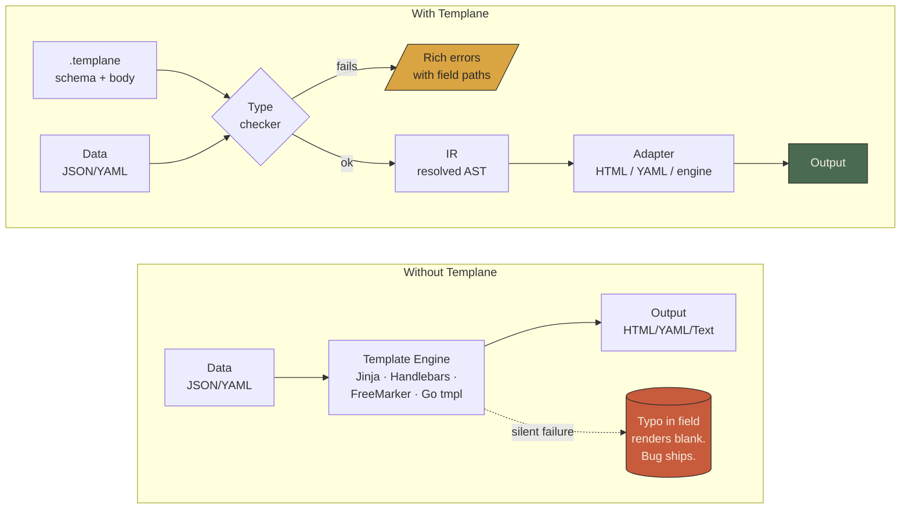
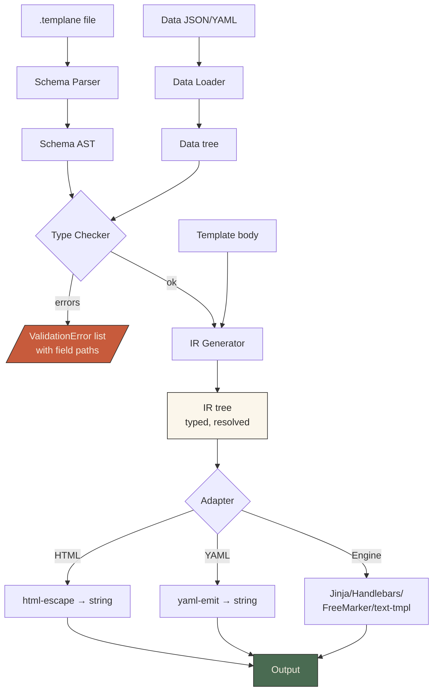
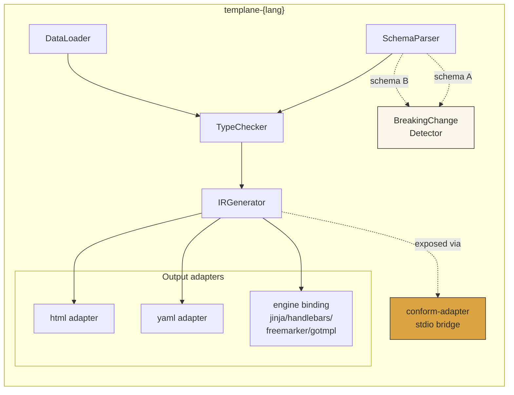
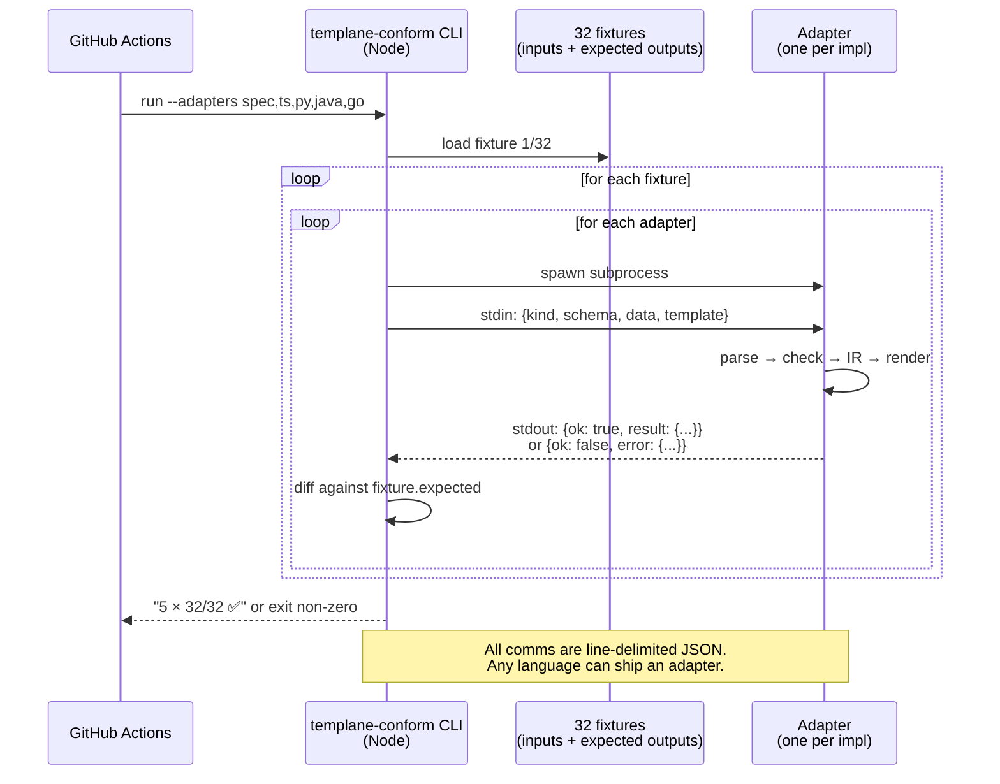
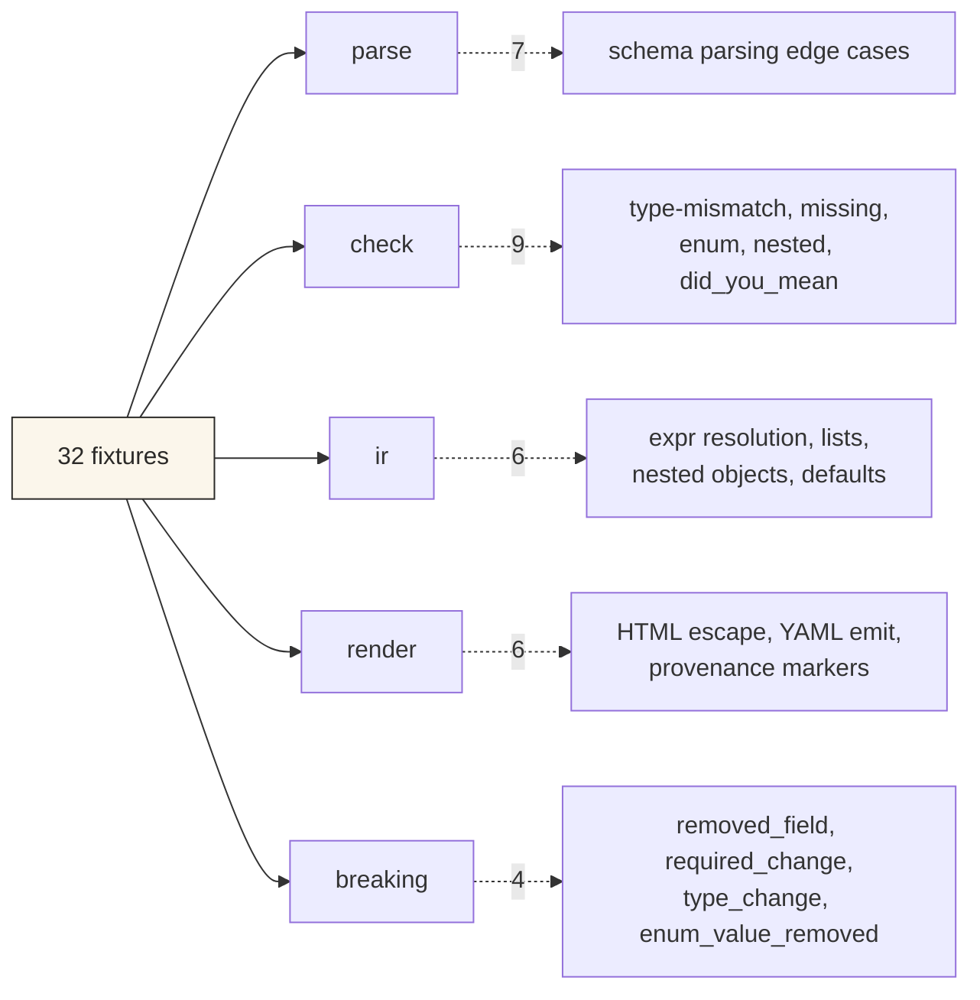
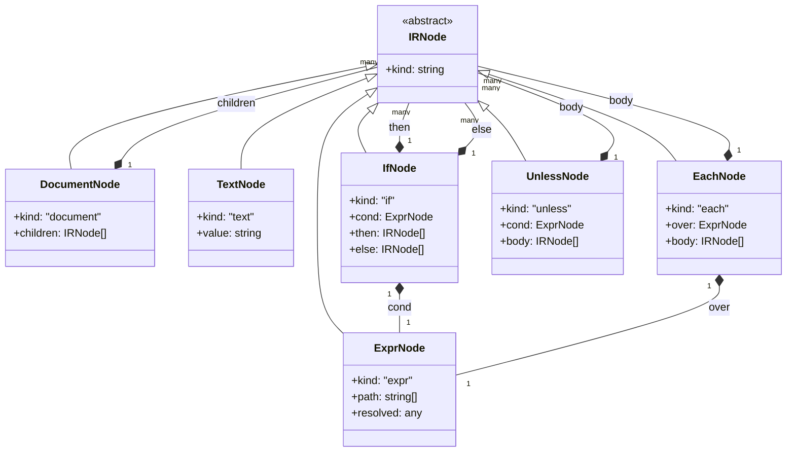
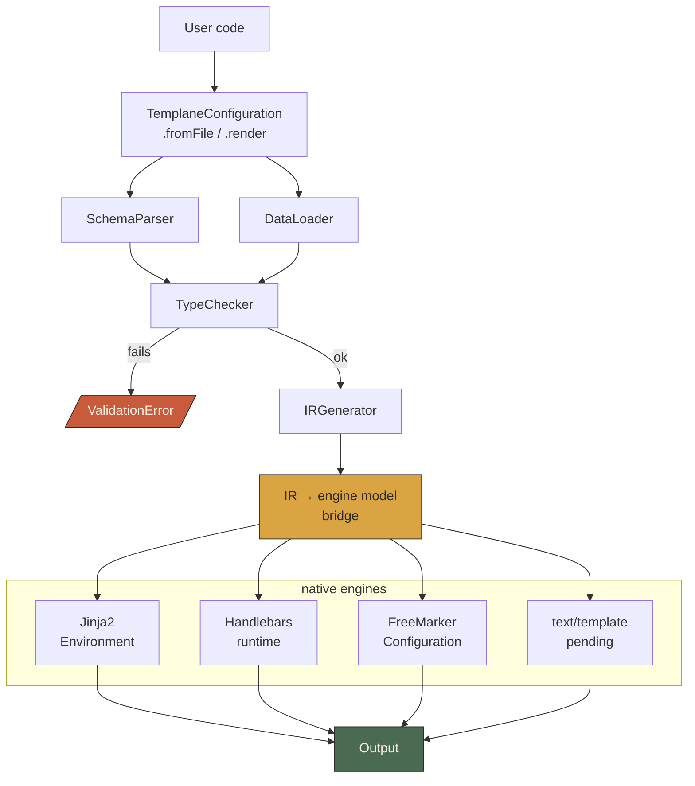
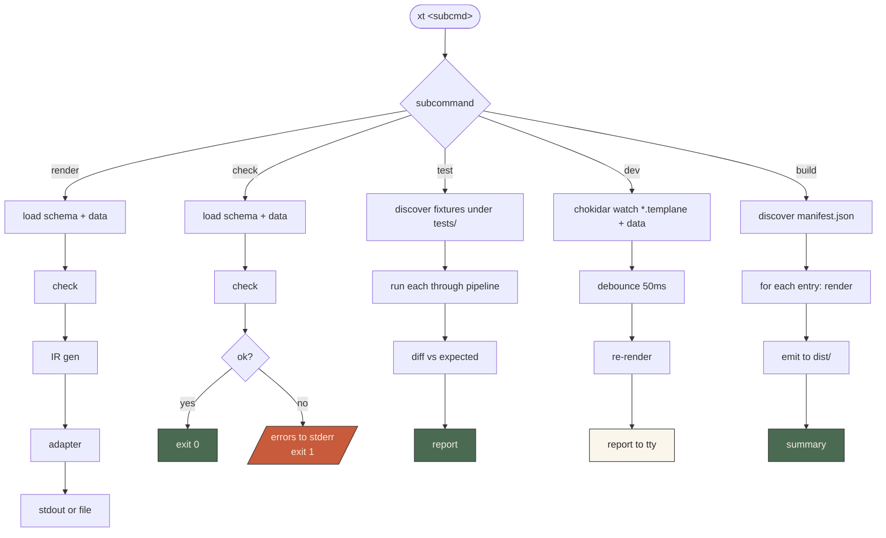
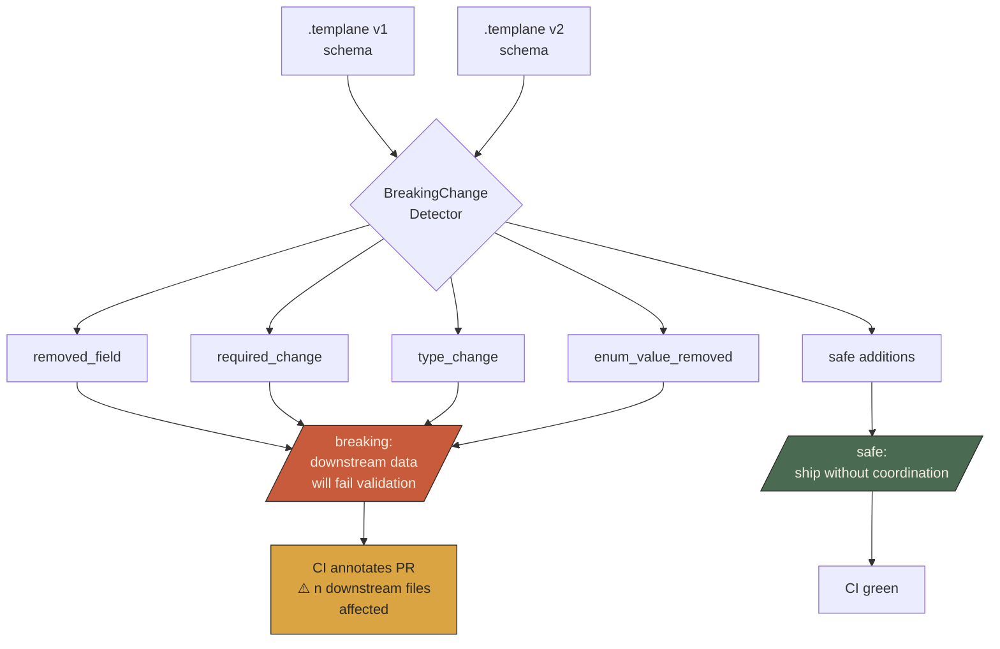
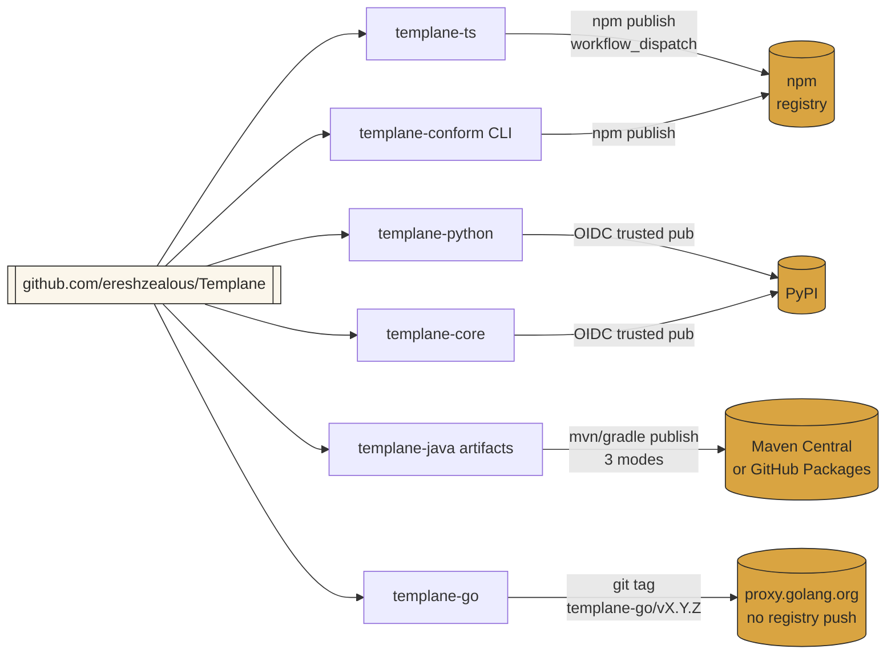

# Architecture

This document explains how Templane is put together: the protocol pipeline,
how the five implementations stay in lock-step, how engines plug in, and
how schema evolution is checked. Every diagram is Mermaid and renders
natively on GitHub.

- [1. Where Templane fits (context)](#1-where-templane-fits-context)
- [2. The rendering pipeline](#2-the-rendering-pipeline)
- [3. Per-language anatomy](#3-per-language-anatomy)
- [4. Cross-implementation conformance](#4-cross-implementation-conformance)
- [5. The IR (intermediate representation)](#5-the-ir-intermediate-representation)
- [6. Engine-binding pattern](#6-engine-binding-pattern)
- [7. xt CLI pipeline](#7-xt-cli-pipeline)
- [8. Schema evolution & breaking-change detection](#8-schema-evolution--breaking-change-detection)
- [9. Publishing topology](#9-publishing-topology)

---

## 1. Where Templane fits (context)

Most template engines take raw data and raw strings and produce output.
Templane inserts a **typed schema contract** between the data and the
engine, and a **checker + IR generator** before rendering.

**The shift**: rendering moves from *"pray the data matches"* to *"prove
the data matches, then render"*. Errors surface at check time with the
exact field path — not at 2am when a customer sees a blank email.

---

## 2. The rendering pipeline

This is the hot path. Every Templane implementation runs these six steps.

**Key property**: the IR is **post-check**. By the time it reaches any
adapter, the adapter can assume every field access is valid. Adapters
never need to handle missing-field errors.

---

## 3. Per-language anatomy

Every implementation has the same internal layout. This is what makes
conformance possible — identical seams.

**The five implementations**:

| Impl | Language | Engine binding | Package manager |
|---|---|---|---|
| `templane-spec/templane-core` | Python | reference | uv |
| `templane-ts` | TypeScript | handlebars-templane | npm |
| `templane-python` | Python | jinja_templane | uv |
| `templane-java` | Java 21 | freemarker-templane | Gradle → M2 |
| `templane-go` | Go 1.22+ | (pending) gotmpl-templane | go modules |

Each ships its own `conform-adapter` — a stdio bridge that accepts
fixture inputs and returns results in a single canonical JSON shape.

---

## 4. Cross-implementation conformance

This is how we prove the 5 implementations behave identically. 32
fixtures × 5 adapters = **160 checks** on every CI run.

**Fixture categories** (under `templane-spec/fixtures/`):

---

## 5. The IR (intermediate representation)

The IR is the hand-off shape between the checker and every adapter. It
is a tagged union of node kinds.

**Why a typed IR and not "just use the engine's AST"?**

- Engines lie about types at render time (every value is a string).
- A shared IR makes cross-engine rendering and conformance tractable.
- The IR carries the *resolved* value on each expression — adapters
  never do a second lookup.

---

## 6. Engine-binding pattern

Every engine binding wraps its native engine with a Templane front door.
The pattern is identical across Jinja, Handlebars, and FreeMarker.

**What the bridge does**: map the Templane IR + resolved values into
the shape each engine expects (Jinja's context dict, Handlebars' JSON
context, FreeMarker's `TemplateModel`). Engines still do the actual
string concatenation; they just do it on pre-validated, pre-resolved
data.

---

## 7. xt CLI pipeline

`xt` is the developer-facing CLI in `templane-ts`. One binary, five
subcommands, one pipeline.

---

## 8. Schema evolution & breaking-change detection

When a `.templane` schema changes, the `BreakingChangeDetector` compares
old vs new and classifies the diff.

**Category reference**:

| Category | Example | Impact |
|---|---|---|
| `removed_field` | schema had `email`, now doesn't | Data files still sending `email` → `unknown_field` error |
| `required_change` | optional → required | Data files missing the field → `missing_required_field` |
| `type_change` | string → number | Every data file → `type_mismatch` |
| `enum_value_removed` | `[A, B, C]` → `[A, B]` | Any data using `C` → `invalid_enum_value` |

Safe changes (never flagged): new optional fields, new enum values added,
relaxed constraints (required → optional).

---

## 9. Publishing topology

How each artifact flows from the monorepo to its registry.

**Trigger model**: every release workflow is `workflow_dispatch` only —
no auto-publish on push or tag. Each workflow has a dry-run flag.

---

## Where to go next

- [`SPEC.md`](../SPEC.md) — the normative protocol spec (RFC 2119 keywords, fixture-referenced).
- [`CONTRIBUTING.md`](../CONTRIBUTING.md) — adding a language binding, adding an engine integration.
- [`examples/`](../examples/) — six progressive tiers from hello-world to Helm chart validation.
- [`.github/workflows/README.md`](../.github/workflows/README.md) — CI and release workflow reference.
